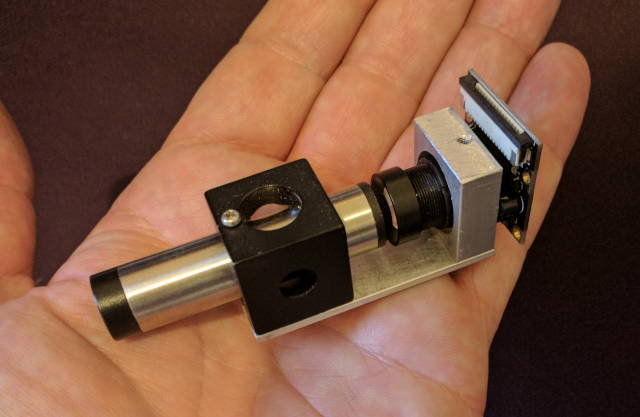
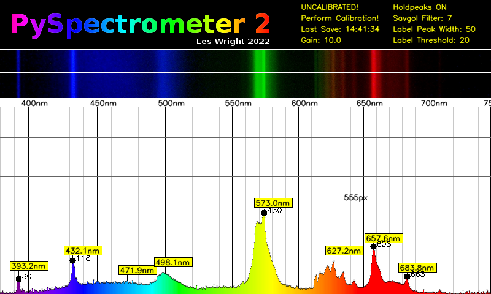

# PySpectrometer2

This program, hardware design, and associated information is Open Source (see Licence), but if you have gotten value from these kinds of projects and think they are worth something, please consider donating: https://paypal.me/leslaboratory?locale.x=en_GB
The Second Incarnation of the Spectrometer project!

This project is a follow on from: https://github.com/leswright1977/PySpectrometer 

This is a more advanced, but more flexible version of the original program. It changes the spectrometer from 'toy' to serious instrument!

Recent changes in the OS (Bullseye) broke the old vesion e.g broken video, broken dependencies and so on. PySpectrometer v3.0 was hacked and fixed as of 3.1), however I have been thinking about a rewrite of this software for a while, so here it is!

Tk has been dropped as the GUI to allow easier maintainability, extendability and flexibility. The new interface is coded entriely in OpenCV, and whilst things like trackbars and buttons are now dropped in favour of keybindings, this frees up screen real estate, and allows the support of resizing without fuss, and fullscreen mode is now supported!

In Fullscreen mode on Raspberry Pi systems, the interface is designed to fit 800*480 screens, which seem to be a common resolution for RPi LCD's, paving the way for the creation of a stand alone benchtop instrument.

Whats new:

- Higher reolution (800px wide graph).

- 3 row pixel averaging of sensor data.

- Fullscreen option for the Spectrometer graph.

- 3rd order polymonial fit of calibration data for accurate measurement.

- Improved graph labelling.

- Labelled measurement cursors.

- Optional waterfall display for recording spectra changes over time.

- Key Bindings for all operations.

- Analogue Gain control for the Picam

The funtionality of the previous version has been retained, including peak hold, peak detect, Savitsky Golay filter, and the ability to save graphs as png and data as CSV.

A very cool addition to this project is a Waterfall display! This allows the recording of change in in wavelength over time.
For my purposes this is especially useful for Dye Lasers, however this may be of use to those observing the spectra of light sources that may change in intensity of wavelength.

Example waterfall display of a fluorescent lamp:

Waterfall display of a Dye laser being tuned (Coumarin-1). The jagged tuning curve is because this laser was hand-tuned!

Below the tuning curve of Rhodamine 6G

# Hardware

The hardware is simple and widely avilable and so should be easily to duplicate without critical alignment or difficult construction. The hard work was developing the software.

Resolution/accuracy seems is subnanometre with a well built and calibrated setup, which is excellent for the price of the hardware, especially when you consider the price of commercial components such as the Hamamatsu C12880MA breakout boards which run north of 300 bucks, and has a resolution of 15nm. Of course, this build is physically much larger, but not enormous!

Visit my Youtube Channel at: https://www.youtube.com/leslaboratory

The hardware consists of:

A commercial Diffraction grating Spectroscope https://www.patonhawksley.com/product-page/benchtop-spectroscope

A Raspberry Pi Camera (with an M12 Thread) https://thepihut.com/products/raspberry-pi-camera-adjustable-focus-5mp

A CCTV Lens with Zoom (M12 Thread) (Search eBay for F1.6 zoom lens)

Everything is assembled on an aluminium base (note the Camera is not cooled, the heatsink was a conveniently sized piece of aluminium.)

For the MINIATURE version the hardware is:

Screenshot

A commercial Diffraction grating Pocket Spectroscope: https://www.patonhawksley.com/product-page/pocket-spectroscope

A Raspberry Pi Camera (with an M12 Thread): https://thepihut.com/products/raspberry-pi-camera-adjustable-focus-5mp

M12x0.5 F2.0 Fixed 12mm Focal length Lens: https://www.ebay.co.uk/itm/114551239930

# User Guide

## Key Bindings:

### Graph Display Controls
* t/g = Analogue Gain up/down
* o/l = savpoly up/down
* i/k = peak width up/down
* u/j = Label threshold up/down
* h = hold peaks

### Calibration and General Software
* m = measure (Toggles measure funtion. In this mode a crosshairs is displayed on the Spectrogram that allows the meaurement of wavelength)
* p = record pixels (Toggles pixel function (Part of the calibration procedure) allows the selection of multiple pixel positions on the graph)
* x = clear points (Clear selected pixel points above)
* c = calibrate (Enter the calibration routine, requires console input)
* s = save data (Saves Spectrograph as png and CSV data. Saves waterfall as png.
* q = quit (Quit Program)

## Starting the program

First, clone this repo!

In /src you will find:

* PySpectrometer2-Picam2-v1.0.py  (PySpectrometer for Raspberry Pi)
* PySpectrometer2-USB-v1.0.py     (Dev version of this program (uses USB camera on a Debian PC (May or mway not work for you, probably won't work on the Pi!)
* specFunctions.py                (A library of funtions including: Wavelength to RGB, SavGol filter from Scipy, Peak detedct from peakutils, readcal and writecal.

To run the program, first make it executable by running: chmod +x PySpectrometer2-Picam2-v1.0.py
Run by typing: ./PySpectrometer2-Picam2-v1.0.py

When first started, the spectrometer is in an uncalibrated state! You must therefore perform the calibration procedure, but at this stage you should be able to focus and align your camera with your spectroscope using the preview window. Is is expected that red light is on the right, and blue-violet on the left.
An excellent choice for this is daylight, as well defined Fraunhoffer lines are indicative of good camera focus.

## Calibration

This version of the PySpectrometer performs Polynomial curve fitting of the user provided calibration wavelengths. This procedure if done with care with result in a precision instument!

When light from a diffaction grating falls upon a flat sensor the dispersion of light is not linear, and so calibration with just two data points (as in the old version of this software) will result in innacurate readings. This nonlinearity is likely compounded by additional nonlinearities introduced by the camera lenses. To address the nonlinearity, the user must provide the pixel positions of at least 3 known wavelengths (4 to 6 is highly recommended for high accuracy!). This information is then used by the program to compute the wavelengths of every single pixel position of the sensor.

Where 3 wavelengths are used for calibration, the software will perform a 2nd order polynomial fit (Reasonably accurate)

Where 4 or more wavelengths are used, the software will perform a 3rd order polymonial fit (Very accurate)

Assuming your physical spectrometer setup is rigid and robust (not held together with gravity, tape or hot glue!), calibration will only need to be done once (Data is saved to a file called: caldata.txt), and therafter when any change is made to the physical setup.

Direct your Spectrometer at a light source with many discrete emission lines. A target illuminated by Lasers would be an exellent (though very expensive!) choice! An inexpensive alternative is a Fluorescent tube.

You should be able to identify several peaks in your graph, now you need to match them up with known good data. For serious work I would recommend an academic resource such as: https://physics.nist.gov/PhysRefData/Handbook/Tables/mercurytable2.htm however in the spirit of citizen science (and because fluorescent lamps are somewhat variable in manufacture), I would recommend this wkipedia article to get you started: https://en.wikipedia.org/wiki/Fluorescent_lamp have a read, and scroll down to the section called: Phosphor composition. In here you will find emission spectra of a variety of fluorecent lamps!

Likely the most useful is this graph: https://commons.wikimedia.org/wiki/File:Fluorescent_lighting_spectrum_peaks_labeled_with_colored_peaks_added.png

These are the notable visible peaks:
* 1 405.4 nm (Mercury) 
* 2 436.6 nm (Mercury)        
* 3 487.7    (Terbium)
* 4 542.4    (Terbium)
* 5 546.5    (Mercury)
* 12 611.6   (Europium)
* 14 631.1   (Europium)

Once you have identified some peaks, at least 3, but even better 4 to 6, firts press 'h' to goggle on peak hold, this will stabilize the graph, and even allow you to switch off the light source!

Press the 'p' key on the keyboard. This will toggle on the pixel measuring crosshairs, move the crosshairs to each of your peaks, and click once the crosshairs are aligned with the 'flagpole' of the wavelength marker.
Rinse and repeat for your identified peaks. (Note it makes sense to do this from left to right!)

Once you have selected all of your peaks, press 'c' and turn your attention to the terminal window.
For each pixel number, enter the identified wavelength.

Once you have entered the wavelengths for each data point, the software will recalibrate the graticule and its internal representation of all the wavelength data.
In the console, it will print out the value of R-Squared. This value will give an indication of how well the calulated data matches your input data. The closer this value is to 1, the more accurately you recorded your wavelengths! for example a six nines fit (0.999999xxxx) is excellent, and 5 nines is good. If it is a way off, one or more of your identified wavlengths may be incorrect, and you should repeat the calibaration procedure! (Press 'x' to clear the points!)

### Check your work
Refer back to the graph from the wiki, can you identify with a reasonable degree of accuracy other peaks? (bearing in mind your fluorescent lamp may differ from the one on the wiki!).

In the screenshot above above, a well defined peak (not used as a caibration value) at 587.4nm has been detected. Referring to the Wiki this is listed at 587.6nm, only 0.2nm off with a five nines calibration! :-)
For unlabelled peaks, pressing 'm' will toggle on the measurement crosshairs, that display wavelength for any given position.

Calibration data is written to a file (caldata.txt), so calibration is retained when the program is restarted.

# Future work:

It is planned to add inputs of some description, to allow the use of buttons and knobs to control the Spectrometer.

The type of inputs will depend on oddly the type of screen!

The hyperpixel displays consume all of the GPIO on the Pi, however buttons could easily be provided if they talk HID.

DSI displays could be used, however seeimingly that would require the user roll back to legacy camera support!

HDMI displays can be used, and this would free up all the GPIO.

A one size fits all approach would be a HID device, there is plenty of choice, including using a Teensy or an Arduino and buttons, or even a number pad with custom keycaps.

I am thinking of implementing something approaching autocalibration, though this might be difficult implement for all use-cases.

